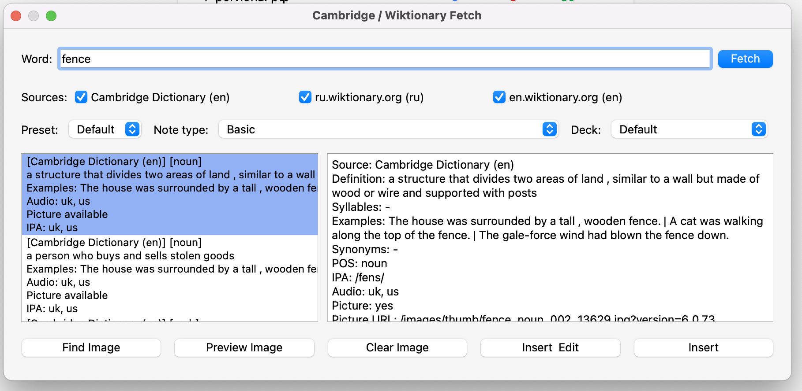
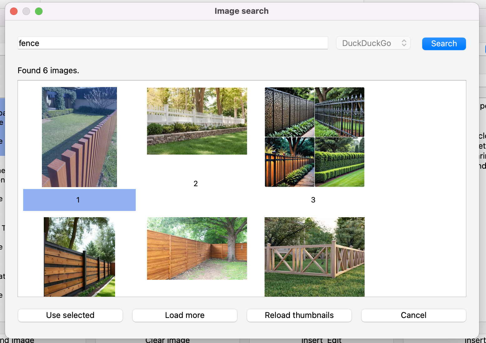

# Cambridge / Wiktionary Fetcher

An Anki add-on that fills notes with data from Cambridge Dictionary, ru.wiktionary.org, and en.wiktionary.org.

## Features
- Fetches word, definitions, examples, synonyms, and part of speech.
- Extracts IPA and audio when available.
- Adds an image to a note field via a dedicated image search dialog.
- Suggests close word variants when no exact match is found (typo/fuzzy suggestions).
- Validates typo suggestions against real dictionary entries.
- Writes data into your fields through configurable field mapping.

## Image Search
- The current version uses only `DuckDuckGo`.
- Provider selection remains in settings, but only one provider is currently available.
- Image settings:
`image_search.provider`, `image_search.max_results`, `image_search.safe_search`.

## Usage
1. Open `Tools -> Dictionary Fetch (Cambridge/Wiktionary)`.
2. Enter a word and choose a source.
3. Click `Fetch` and select a sense.
4. Optionally click `Find Image` and choose an image.
5. Click `Insert` or `Insert & Edit`.

## Screenshots
<table>
  <tr>
    <td align="center">
      
       
      <em>Main fetch dialog.</em>
    </td>
    <td align="center">
      
       
      <em>Image finder dialog.</em>
    </td>
  </tr>
</table>

## Settings
Open `Tools -> Dictionary Fetch - Settings`.

Available options:
- default note type and deck;
- default source;
- Cambridge dialect priority (UK/US);
- image result count and `safe_search`;
- typo suggestions on/off and max number of confirmed suggestions;
- field mapping (`word`, `definition`, `examples`, `synonyms`, `pos`, `ipa`, `audio`, `picture`);
- RU Wiktionary mapping (`wiktionary.field_map.syllables`).
